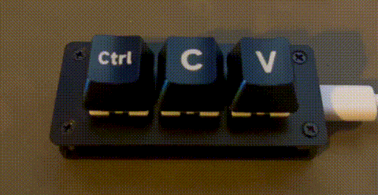

# 3-key

This project is focused on the [3-Key Development Board from Waveshare](https://www.waveshare.com/rp2040-keyboard-3.htm).

It introduces the base firmware written in C++ using the Pico-SDK.

Version [v0.0.2](https://github.com/dtrochow/3-key/releases/tag/v0.0.2) of the firmware adds CTRL+C/CTRL+V capabilities and simple RGB color support (each button has its own color).

The [build.py](https://github.com/dtrochow/3-key/blob/main/build.py) script can be used only with the FW versions grater than **v0.1.0**.
All previous versions require [the manual firmware update process](https://3-key.dtrochow.ovh/development/#manually).

## Documentation

The detailed documentation is available here: [3-key Project Documentation](https://3-key.dtrochow.ovh/)
