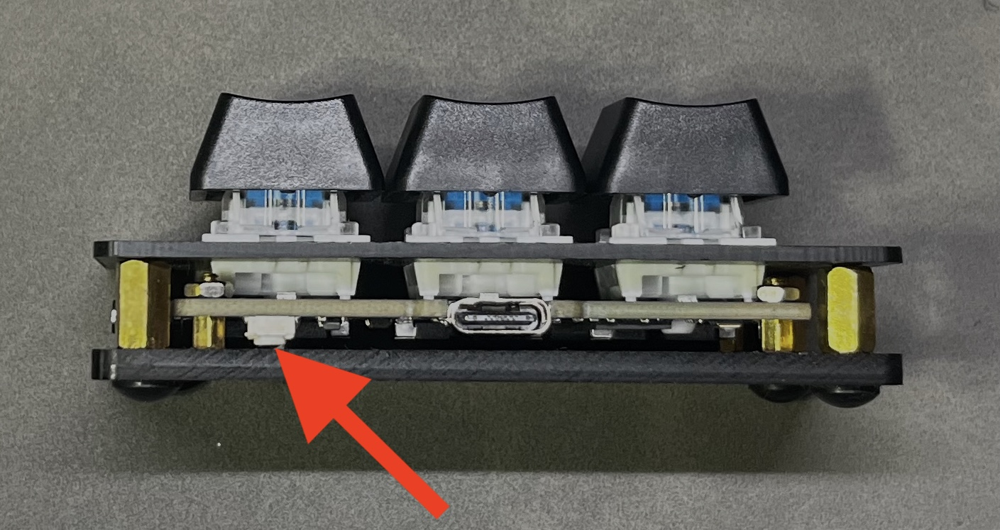
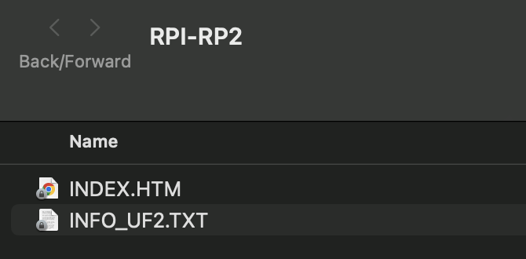
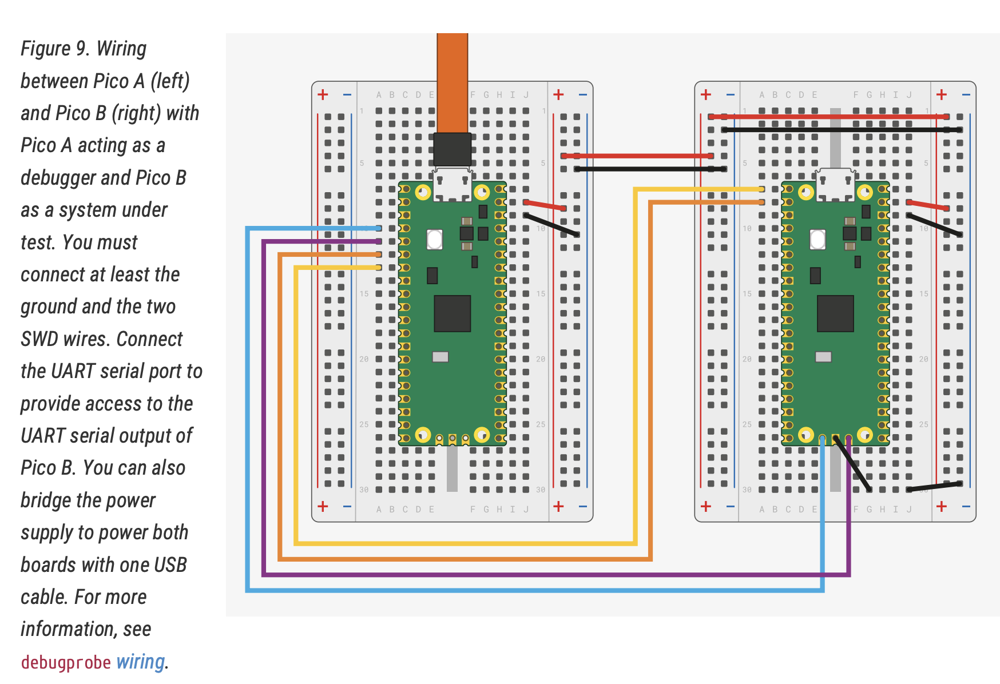

# Development

## Linux

### **Requirements**

- 2 x [Raspberry Pi Pico microcontrollers](https://www.raspberrypi.com/products/raspberry-pi-pico/)

- References:
    - [Getting Started With Pico](https://datasheets.raspberrypi.com/pico/getting-started-with-pico.pdf)
    - [Pico Datasheet](https://datasheets.raspberrypi.com/pico/pico-datasheet.pdf)
    - [Pico-SDK](https://datasheets.raspberrypi.com/pico/raspberry-pi-pico-c-sdk.pdf)

### **Build environment preparation**

- Install all required tools

```bash
$ sudo apt update
$ sudo apt upgrade
$ sudo apt install cmake gcc-arm-none-eabi libnewlib-arm-none-eabi build-essential
```

- Prepare pico-sdk

    - Clone pico-sdk repsitory

    ```bash
    git clone https://github.com/raspberrypi/pico-sdk
    ```

    - Update pico-sdk

    ```bash
    cd pico-sdk
    git pull
    git submodule update
    ```

    - Set the PICO_SKD_PATH to the pico-sdk loaction

        - Add exporting this environment variable to .bashrc file

        ```bash
        vim .bashrc
        export PICO_SDK_PATH=~/path/to/pico-sdk
        ".bashrc" 119L, 3809B
        ```

        - Restart terminal

### **Building firmware**

```bash
cd firmware
mkdir build
cd build
cmake ..
make -j
```

It will generate the `3-key.uf2` file in `build` directory.

## Docker

For building the binary for RPi Pico, the `dtrochow/3-key:latest` container can be used.

Dockerfile is available in [3-key/docker](https://github.com/dtrochow/3-key/tree/main/docker) directory.

### **Building on amd64 platform**

``` console
docker build -t dtrochow/3-key:v0.0.1 .

# Pushing to repository
docker login
docker push dtrochow/3-key:v0.0.1
```

### **Building on arm64 platform**

``` console
docker buildx build --platform linux/amd64 -t dtrochow/3-key:v0.0.1 .

# Pushing to repository
docker login
docker push dtrochow/3-key:v0.0.1
```

## Uploading firmware UF2 binary to 3-key

### **Automatically**

**Requirements**

- [Python3](https://www.python.org/downloads/)
- [Picotool](https://github.com/raspberrypi/picotool)

The 3-key firmware can be build and loaded using `build.py` script.

It will perform the following actions:

- Build firmware (`--clean` parameter will cause re-building all files)

- Below actions will be done only with `--load` parameter
    - Reset the RPi Pico device to bootloader
    - Load the new firmware
    - Reboot RPi Pico device

**Example usage:**

``` bash
python3 ./build.py --clean --load
```

### **Manually**

- Connect the `3-key` RPi Pico device with `BOOT` button pressed



- Copy the `3-key.uf2` binary to the `RPI-RP2` drive, which mounts when booting with `BOOT` button pressed



- Firmware is updated


## **Debug environment preparation**

- Wiring

    All wiring is described in [Getting started with Raspberry Pi Pico](https://datasheets.raspberrypi.com/pico/getting-started-with-pico.pdf)

    
    Source: [Getting started with Raspberry Pi Pico](https://datasheets.raspberrypi.com/pico/getting-started-with-pico.pdf)

- Prepare PicoProbe
   - Clone picoprobe repository

    ```bash
    cd ~/pico
    git clone https://github.com/raspberrypi/picoprobe.git
    ```

    - Build picoprobe

    ```bash
    cd picoprobe
    mkdir build
    cd build
    cmake ..
    make -j4
    ```

    - Flash the picoprobe FW on Raspberry Pi Pico
        - Boot the Raspberry Pi Pico which will be used as a debugger with the BOOTSEL button pressed and drag on picoprobe.uf2.

- Change PicoProbe USB device privilages

    The PicoProbe USB device needs to has proper privilages in Linux OS, to avoid using sudo privilages during debugging

    - Use following command
        ```bash
        echo 'SUBSYSTEMS=="usb", ATTRS{idVendor}=="2e8a", ATTRS{idProduct}=="0004", GROUP="users", MODE="0666"' | sudo tee -a /etc/udev/rules.d/98-PicoProbe.rules
        sudo udevadm control --reload
        ```
        To find the _idVendor_ and _idProducd_ you can use `lsudb -vvv` command.

        You need to find thhose fields under `Raspberry Pi Picoprobe`.

- Prepare OpenOCD server

    - Install required tools

        ```bash
        cd ~/pico
        sudo apt install automake autoconf build-essential texinfo libtool libftdi-dev libusb-1.0-0-dev
        ```
    - Clone openocd repository

        ```bash
        git clone https://github.com/raspberrypi/openocd.git
        ```

    - Build openocd with picoprobe support enabled

        ```bash
        cd openocd
        ./bootstrap
        ./configure --enable-picoprobe
        make -j4
        ```
    - You can check if PicoProbe and OpenOCD server works properly by running this command when every connection is established properly
        ```bash
        src/openocd -f interface/picoprobe.cfg -f target/rp2040.cfg -s tcl
        ```

- Prepare VSCode debug configuration

    - Install `Cortex-Debug` extension in VSCode
    - Install `C/C++` and `C/C++ Extension Pack` extensions in VSCode
    - Create following configuration files under `.vscode` directory

        **launch.json**
        ```json
        {
            "version": "0.2.0",
            "configurations": [
                {
                    "name": "Pico Debug",
                    "cwd": "${workspaceRoot}",
                    "executable": "<path_to_binary_with_FW>",
                    "request": "launch",
                    "type": "cortex-debug",
                    "servertype": "openocd",
                    "serverpath": "<path_to_openocd_repo>/src/openocd",
                    // This may need to be arm-none-eabi-gdb depending on your system
                    "gdbPath" : "arm-none-eabi-gdb",
                    "device": "RP2040",
                    "configFiles": [
                        "interface/picoprobe.cfg",
                        "target/rp2040.cfg"
                    ],
                    "svdFile": "${env:PICO_SDK_PATH}/src/rp2040/hardware_regs/rp2040.svd",
                    "runToMain": true,
                    // Work around for stopping at main on restart
                    "postRestartCommands": [
                        "break main",
                        "continue"
                    ],
                    "searchDir": ["<path_to_openocd_repo>/openocd/tcl"]
                }
            ]
        }
        ```
        In some cases the serverpath field needs to be added - [issue](https://github.com/Marus/cortex-debug/issues/201#issuecomment-541278876)

        **settings.json**
        ``` json
        {
            // These settings tweaks to the cmake plugin will ensure
            // that you debug using cortex-debug instead of trying to launch
            // a Pico binary on the host
            "cmake.statusbar.advanced": {
                "debug": {
                    "visibility": "hidden"
                },
                "launch": {
                    "visibility": "hidden"
                },
                "build": {
                    "visibility": "default"
                },
                "buildTarget": {
                    "visibility": "hidden"
                }
            },
            "cmake.buildBeforeRun": true,
            "C_Cpp.default.configurationProvider": "ms-vscode.cmake-tools",
            "cortex-debug.openocdPath": "<path_to_openocd_repo>/openocd/src/openocd"
        }
        ```

## Windows

### **How to attach Picoprobe to the Docker container**

To enable debugging with the Picoprobe on Windows using Docker, follow these steps:

1. **Enable Docker Integration with Additional Distros**:
   - Open Docker Desktop.
   - Go to the **Settings** menu.
   - Under the **Resources** tab, enable the option: **Enable integration with additional distros**.

2. **Share the USB Device with WSL**:
   You will need to bind the USB device to WSL to make it available to the Docker container. Follow the steps below:

   - Open PowerShell as an administrator.
   - List all connected USB devices by running:
     ```powershell
     usbipd list
     ```

   - Find your **Picoprobe device** in the list (e.g., it might show something like `2e8a:0004  Urządzenie szeregowe USB (COM13), Picoprobe`).

   - Bind the Picoprobe device to WSL:
     ```powershell
     usbipd bind --busid <BUSID>
     ```

     Replace `<BUSID>` with the appropriate `BUSID` of your Picoprobe device.

   - Attach the device to WSL:
     ```powershell
     usbipd attach --wsl --busid <BUSID>
     ```

3. **Run Docker with USB Device and verify device is present**:
    After binding and attaching the device, you can run the Docker container with access to the Picoprobe device and :

    ```powershell
    docker run -it --rm --privileged --device /dev/ttyUSB0 3key:latest bash
    ```
    Then verify the device is present using:

    ```powershell
    ls /dev/tty*
    ```
    You should see your device listed (e.g., /dev/ttyACM0 or similar).
