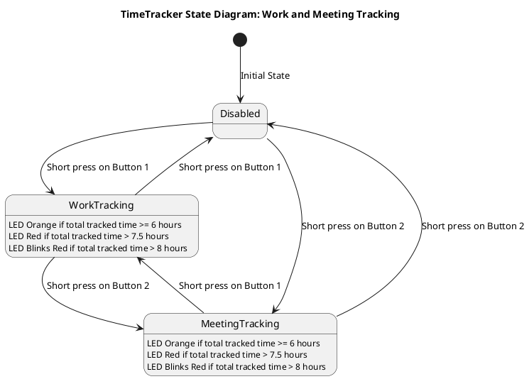
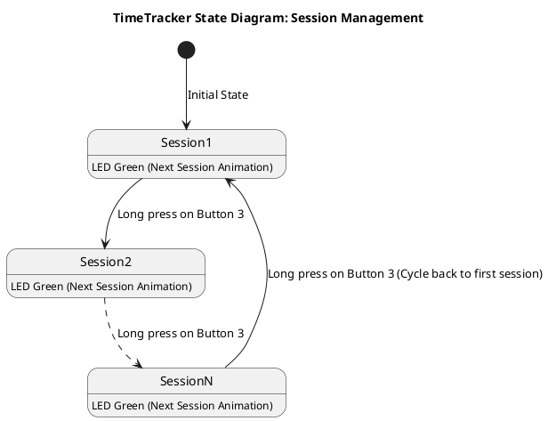

# TimeTracker Documentation

The `TimeTracker` feature enables users to track time spent on various tasks, such as work and meetings, with the press of a button. It also provides visual feedback using LED lights and allows users to log and review their time data.

---

## Key Features

The `TimeTracker` helps track work and meeting times using three buttons with visual feedback through LEDs.

- **Button 1**: Tracks work time.
- **Button 2**: Tracks meeting time.
- **Button 3**: Manages tracking sessions.

---

## How to Use

### How to enable time-tracker feature

To enable the time-tracker feature follow these steps:

1. Connect to text 3-key terminal:

    ```bash
    python tools/connect_serial.py
    ```

2. Run following command:

    ```bash
    3-key>feature time-tracker
    Feature enabled: time-tracker
    ```

3. To check if the feature is enabled you can run:

    ```bash
    3-key>feature
    Current feature: time-tracker
    ```

### Buttons and Their Functions

- **Button 1 (Work Tracking)**:  
   Toggles **Work Tracking**
    - Short press:
        - Starts work time tracking if disabled.
        - Starts work time tracking and disables meeting time tracking if enabled.
        - Stops work time tracking if enabled.
    - LED behavior:
        - Lights purple while working.

- **Button 2 (Meeting Tracking)**:  
   Toggles **Meeting Tracking**
    - Short press:
        - Starts meeting time tracking if disabled.
        - Starts meeting time tracking and disables work time tracking if enabled.
        - Stops meeting time tracking if enabled.
    - LED behavior:
        - Lights cyan when meetings are being tracked.
    - Long press:
        - The device will show the user the current Session ID value.
            - It blinks LED 0 the number of times equivalent to the tens digit of the Session ID value.
            - It blinks LED 1 the number of times equivalent to the ones digit of the Session ID value.

- **Button 3 (Session Management)**:
   Manages tracking sessions.
    - Short press:
        - Blinks green LED X times, where X is the number of tracked hours.
    - Long press:
        - Switches to the next tracking slot/context.
        - Triggers the next session animation.
    - LED behavior
        - Lights yellow when total tracked time (work + meetings) is greater then medium threshold value.
        - Lights red when total tracked time is more than long threshold value.

!!! warning "Confirmation prompt when switching to next session"
    When the next session slot is not empty, the user will be asked to confirm the next session operation.
    Pressing the green button will confirm the operation, while pressing the red button will cancel it and resume tracking if it was previously enabled.

!!! note "Session Management - Number of tracked hours"
    It will blink once until the second hour has passed.

## TimeTracker State Diagram: Work and Meeting Tracking



## TimeTracker State Diagram: Session Management



!!! note
    There must be a timer enabled, which will check if the time passed and if yes then light up appropriate LED colors.

---

## Retrieving Data

### Terminal

To review your tracked time, the `TimeTracker` provides logs that can be generated and displayed in the serial terminal:

1. **Work Time Log**:

    ```bash
    3-key>time work
    ```

    Displays the total time spent on work in the current session.  
    Example Output:
    `2025-01-26 Work: 2h 15min 30s`

2. **Meeting Time Log**:

    ```bash
    3-key>time meetings
    ```

    Displays the total time spent on meetings in the current session.  
    Example Output:
    `2025-01-26 Meetings: 1h 45min 15s`

!!!note "Time synchronization"
    When the time is not synced to the host time, the reported time will default to the epoch start: `01.01.1970 00:00:00`

### Report via script

The `time_report.py` script retrieves detailed reports from the 3-key keyboard. The command to interact with the device is described in the terminal section.

The script supports the following commands:

- `sync_time`  
  Synchronizes the device's time with the host system's current time.

- `get_time_report`  
  Retrieves a detailed time report for the current session or a specific session ID.  
  Example usage:  
  ```bash
  python tools/time_report.py get_time_report --session_id 1
  ```

- `get_current_session_id`  
  Retrieves the ID of the currently active session.

- `new_session`  
  Starts a new session, cycling to the next available session slot.

- `set_threshold`  
  Sets the medium or long threshold for tracked time.  
  Example usage:  
  ```bash
  python tools/time_report.py set_threshold medium 3,30
  ```  
  The above command sets the medium threshold to 3 hours and 30 minutes.

The script provides flexibility to retrieve and format session data for analysis or record-keeping.

---

## Additional Notes

- **Session Limit**: The `TimeTracker` supports up to a predefined maximum number of sessions. Once the limit is reached, it cycles back to the first session.
- **Data Persistence**: All tracked time data is saved, ensuring that it remains available even after powering off the device.
- **Factory Reset**: If needed, the feature can be reset to its factory settings, clearing all stored data.

---

With the `TimeTracker`, you can easily manage and review your time spent on work and meetings, ensuring better productivity and accountability.
