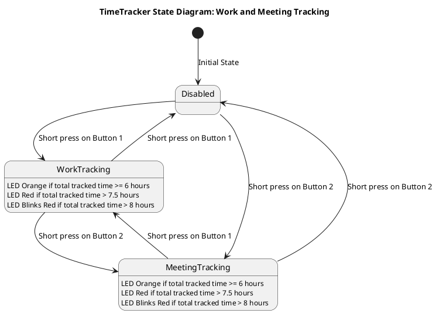
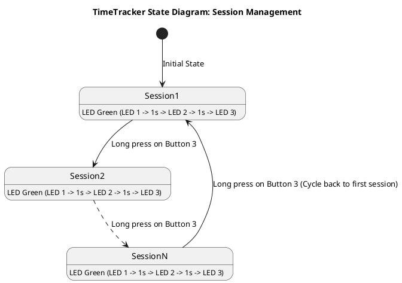

# TimeTracker Documentation

The `TimeTracker` feature enables users to track time spent on various tasks, such as work and meetings, with the press of a button. It also provides visual feedback using LED lights and allows users to log and review their time data.

---

## Key Features

The `TimeTracker` helps track work and meeting times using three buttons with visual feedback through LEDs.

- **Button 1**: Tracks work time.
- **Button 2**: Tracks meeting time.
- **Button 3**: Manages tracking sessions.

---

## How to Use

### Buttons and Their Functions

- **Button 1 (Work Tracking)**:  
   Toggles **Work Tracking**
    - Short press:
        - Starts work time tracking if disabled.
        - Starts work time tracking and disables meeting time tracking if enabled.
        - Stops work time tracking if enabled.
    - LED behavior:
        - Lights purple while working.
        - Lights orange when total tracked time (work + meetings) is 6 hours or more.
        - Lights red when total tracked time is more than 7.5 hours.
        - Blinks red when total tracked time is more than 8 hours.

- **Button 2 (Meeting Tracking)**:  
   Toggles **Meeting Tracking**
    - Short press:
        - Starts meeting time tracking if disabled.
        - Starts meeting time tracking and disables work time tracking if enabled.
        - Stops meeting time tracking if enabled.
    - LED behavior:
        - Lights cyan when meetings are being tracked.
        - Lights orange when total tracked time (work + meetings) is 6 hours or more.
        - Lights red when total tracked time is more than 7.5 hours.
        - Blinks red when total tracked time is more than 8 hours.

- **Button 3 (Session Management)**:
   Manages tracking sessions.
    - Short press:
        - Blinks blue LED X times, where X is the number of tracked hours.
    - Long press:
        - Switches to the next tracking slot/context.
        - Lights up all LEDs sequentially in green (LED 1 -> 1s -> LED 2 -> 1s -> LED 3).

## TimeTracker State Diagram: Work and Meeting Tracking

## TimeTracker State Diagram: Session Management

!!! note
    There must be a timer enabled, which will check if the time passed and if yes then light up appropriate LED colors.

---

## Retrieving Data

### Terminal

To review your tracked time, the `TimeTracker` provides logs that can be generated and displayed in the serial terminal:

1. **Work Time Log**:  
   Displays the total time spent on work in the current session.  
   Example Output:  
   `2025-01-26 Work: 2h 15min 30s`

2. **Meeting Time Log**:  
   Displays the total time spent on meetings in the current session.  
   Example Output:  
   `2025-01-26 Meetings: 1h 45min 15s`

### Report via script

The `time_report.py` script is able to retrieve the report from the 3-key keyboard.
The command that needs to be send to the device is described in terminal section.

Script has the following parameters:

- `-s` - session ID (default current session)

The script will print the following things:

- Day, month and year
- Time spent on working (meetings + other work)
- Time spend on meeting only
- Time spent on other work
- Start of tracking (first tracker enable in session)
- End of tracking (last tracker disable in session)

---

## Additional Notes

- **Session Limit**: The `TimeTracker` supports up to a predefined maximum number of sessions. Once the limit is reached, it cycles back to the first session.
- **Data Persistence**: All tracked time data is saved, ensuring that it remains available even after powering off the device.
- **Factory Reset**: If needed, the feature can be reset to its factory settings, clearing all stored data.

---

With the `TimeTracker`, you can easily manage and review your time spent on work and meetings, ensuring better productivity and accountability.
