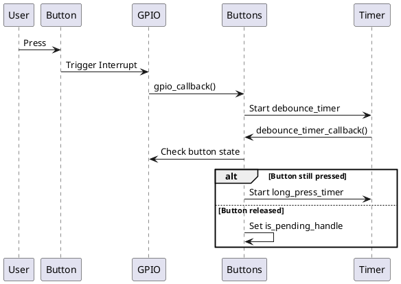
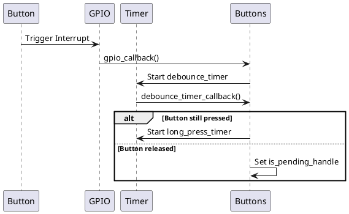
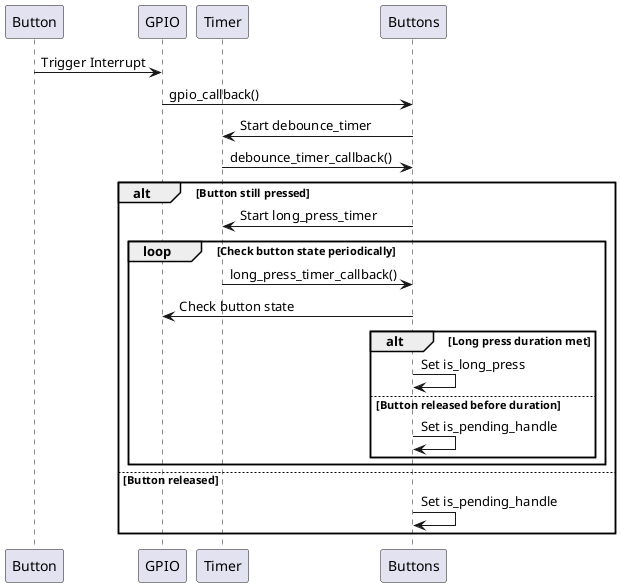

# Buttons

## Button Press Detection Mechanism

The button press detection mechanism in the 3-key project involves several key components and processes to ensure accurate detection of both short and long presses. This document describes the overall mechanism, including debouncing and long press detection.

### Short Press Detection

When a button is pressed, an interrupt is triggered, and the `gpio_callback` function is called. This function checks if the button is already debouncing or pending handling. If not, it starts a debounce timer to filter out any noise or false triggers.

### Debouncing

Debouncing is the process of filtering out noise or false triggers that can occur when a button is pressed or released. The debounce timer ensures that the button state is stable before considering it as a valid press.

### Long Press Detection

Long press detection involves starting a long press timer after the debounce timer confirms a valid press. The long press timer periodically checks if the button is still pressed. If the button remains pressed for a duration longer than the configured long press delay, it is considered a long press.

### Summary

- **Short Press Detection**: Triggered by an interrupt, followed by a debounce timer to confirm the press.
- **Debouncing**: Filters out noise and false triggers to ensure a stable button state.
- **Long Press Detection**: Starts a long press timer after debouncing, periodically checks the button state, and confirms a long press if the button remains pressed for the configured duration.

---
