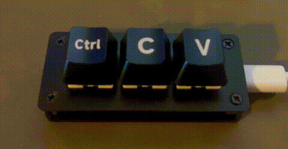

# 3-key

This project is focused on the [3-Key Development Board from Waveshare](https://www.waveshare.com/rp2040-keyboard-3.htm).

It introduces the base firmware written in C++ using the Pico-SDK.

Version [v0.0.2](https://github.com/dtrochow/3-key/releases/tag/v0.0.2) of the firmware adds CTRL+C/CTRL+V capabilities and simple RGB color support (each button has its own color).



## Serial Terminal

To connect to the Serial Terminal the `connect_serial.py` script can be used.

``` terminal
python3 connect_serial.py
```

It finds the RPi Pico serial device name and connects to it using `picocom` tool.

All requirements are listed in `requirements.txt` file.

## How to run documentation locally

1. Run docker container with the `-d` parameter (documentation)
```bash
python3 run_docker.py -d
```

2. The documentation will be available on [http://127.0.0.1:8000](http://127.0.0.1:8000/) address in any browser

## Support

If you would like to contribute to the project or have any questions, please do not hesitate to create an issue or send an email to [dominik.trochowski@gmail.com](mailto:dominik.trochowski@gmail.com)
